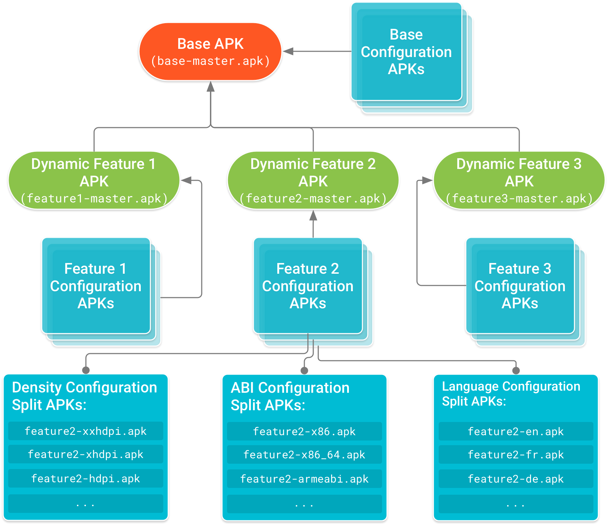

# app-bundles-dynamic-delivery-sample

# App Bundles

# Dynamic Delivery

## Overview

* Dynamic Delivery là mô hình phục vụ ứng dụng của Google Play, nó sử dụng **App Bundles** để tạo và phục vụ APK được tối ưu hóa cho từng thiết bị với API cần thiết và tối ưu dung lượng các bản Apk.

* Phần lớn các APK đã được tối ưu hóa khi sử dụng với Dynamic Delivery. Nếu bạn đã sắp xếp source code và các resource theo các quy định đã được thiết lập, chỉ cần build ứng dụng của bạn với App Bundle sử dụng Android Studio hoặc sử dụng command line và đẩy ứng dụng lên chợ Google Play.

### Dynamic Delivery with split APKs

* Thành phần cơ bản của Dynamic Delivery là cơ chế phân chia APK có sẵ trên Android 5.0 trở lên. Cơ chế này giống với các Apk thông thường bao gồm mã byte DEX được biên dịch, các resource của Android và tệp AndroidManifest.

* Tuy vậy nền tảng Android có thể chia nhỏ nhiều apk để cài đặt như 1 ứng dụng. Nghĩa là bạn cso thể cài đặt nhiều APK phân chia có quyền truy cập vào mã và tài nguyên chung và xuất hiện dưới dạng 1 ứng dụng được cài đặt trên thiết bị.

#### Base APK

* APK này chứa tất cả các mã và resource mà tất cả các APK split khác có thể truy cập và cung cấp chức năng cơ bản cho ứng dụng. Khi người dùng yêu cầu tải xuống ứng dụng của bạn, APK này sẽ được tải xuống và cài đặt trước.

* Điều đó bởi vì có tệp AndroidManifest của APK base khai báo đầy đủ các dịch vụ, ứng dụng cung cấp nội dung, quyền, yêu cầu về version và phụ thuộc vào các tính năng của hệ thống.

* Tất cả mã và tài nguyên ban đầu ứng dụng của bạn đều năm trong này.

#### Configuration APKs

* Mỗi APK này bao gồm các thư viện và tài nguyên riêng cho từng loại màn hình, kiến trúc CPU hoặc ngôn ngữ cụ thể. Khi người dùng tài xuống ứng dụng của bạn, họ sẽ chỉ tải APK nhắm mục tiêu vào thiết bị của họ.

* Mỗi APK cấu hình là một phụ thuộc của **Base APK** hoặc là **Dynamic feature APKs**, chúng được tải xuống và cài đặt cùng với APK mà chúng cung cấp source và tài nguyên cho.

* Không giống như base hoặc dynamic feature, bạn không tạo 1 module riêng cho configuration apk.

* Nếu bạn sử dụng tiêu chuẩn để sắp xếp các tài nguyên thay thế, dành riêng cho cấu hình các module dynamic feature hoặc là base apk, Google Play sẽ tự tạo Configuration APK.

#### Dynamic feature APKs

* Mỗi APK này chưa mã và tài nguyên của 1 tính năng trong ứng dụng mà bạn module nó, thông qua dynamic, sau đó bạn có thể tùy chỉnh cách thức và thời điểm tải về trên thiết bị. Ví dụ 1 số ứng dụng phải truy cập vào module mới yêu cầu tải thêm dữ liệu của phần đó về.

