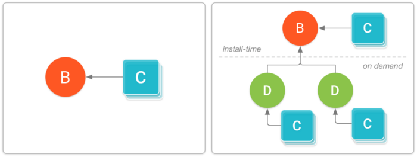
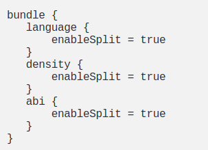

# app-bundles-dynamic-delivery-sample

# App Bundles

## Overview

* Tại Google I/O 2018, một định dạng publish app mới đã được giới thiệu cho các app Android có tên là **Android App Bundle(.aab)**. Đây là định sạng tải lên mới bao gồm tất cả các mã code và tài nguyên được biên dịch, nhưng trì hoãn việc tạo APK và signing vào Google Play. 

* Tại sao lại sử dụng định dạng mới này?

    * **Dynamic Delivery**: Mô hình phục vụ ứng dụng mới của Google Play được gọi là **Dynamic Delivery**, người dùng sử dụng app bundle để tạo và cung cấp APK được tối ưu hóa cho từng cấu hình thiết bị của người dùng. Vì vậy họ chỉ tải xuống code và tài nguyên họ cần để chạy ứng dụng của bạn.
    
    * **No need to manually manage multiple APKs**: Bạn không còn phải xây dựng, sign và quản lý nhiều APK để hỗ trợ các thiết bị khác nhau và người dùng có thể có được cá bản tải xuống nhỏ hơn, tối ưu hơn. Ví dụ bây giờ bạn không phải tạo nhiều APK cho các thiết bị có độ phân giải màn hình khác nhau.
    
    * **Dynamic Feature Module**: Các module này chứa các tính năng và tài sản mà bạn có thể quyết định không bao gồm khi người dùng lần đầu tải xuống và cài đặt app của bạn. Sử dụng thư viện **Play Core**, app của bạn sau đó có thể yêu cầu tải xuống các module đó dưới dạng **Dynamic feature APKs**.
    
    * **Reduces APK size**: Sử dụng cơ chế split apk, Google Play có thể chỉa 1 ứng dụng lớn thành các gói nhỏ hơn, riêng biệt được cài đặt trên thiết bị của người dùng theo yêu cầu. Trung bình các ứng dụng được xuấ tbarn với app bundles có kích thước nhỏ hơn 20%.
    
* Để build một app bundle: Bạn có thể dễ dàng build được đối với Android Studio phiên bản **3.2 Canary 14+** hoặc là sử dụng bằng command line

    * **Android Studio(Canary 14+)**: Bạn có thể vào **Build** -> **Build Bundle(s)/APK(s)**
    
    * **Console**: Bạn thực hiện chạy task **./gradlew bundle**
    
    > App bundle sẽ được sinh ra ở thư mục: **app/build/outputs/bundle/buildVariant/bundle.aab**.

## Deploy your app from an app bundle

* Chọn **Run > Edit Configurations**. 

* Chọn module bạn muốn trong phần **Android App**.

* Trong dropdown của Deploy, lựa chọn **APK from app bundle**.

* Trong phần **Dynamic features to deploy**, 

# Dynamic Feature Modules

## Dynamic Delivery

* Thành phần cơ bản của Dynamic Delivery là cơ chế phân chia APK có sẵ trên Android 5.0 trở lên. Cơ chế này giống với các Apk thông thường bao gồm mã byte DEX được biên dịch, các resource của Android và tệp AndroidManifest.

* Tuy vậy nền tảng Android có thể chia nhỏ nhiều apk để cài đặt như 1 ứng dụng. Nghĩa là bạn cso thể cài đặt nhiều APK phân chia có quyền truy cập vào mã và tài nguyên chung và xuất hiện dưới dạng 1 ứng dụng được cài đặt trên thiết bị.

### Dynamic Delivery with split APKs

* **Base APK**: APK này chứa tất cả các mã và resource mà tất cả các split APK khác có thể truy cập và cung cấp chức năng cơ bản cho ứng dụng. Khi người dùng yêu cầu tải xuống ứng dụng của bạn, APK này sẽ được tải xuống và cài đặt trước. Điều đó bởi vì có tệp AndroidManifest của APK base khai báo đầy đủ các dịch vụ, ứng dụng cung cấp nội dung, quyền, yêu cầu về version và phụ thuộc vào các tính năng của hệ thống.

* **Configuration APKs**: Mỗi APK này bao gồm các thư viện và tài nguyên riêng cho từng loại màn hình, kiến trúc CPU hoặc ngôn ngữ cụ thể. Khi người dùng tài xuống ứng dụng của bạn, họ sẽ chỉ tải APK nhắm mục tiêu vào thiết bị của họ. Mỗi APK cấu hình là một phụ thuộc của **Base APK** hoặc là **Dynamic feature APKs**, chúng được tải xuống và cài đặt cùng với APK mà chúng cung cấp source và tài nguyên cho. Không giống như base hoặc dynamic feature, bạn không tạo 1 module riêng cho configuration apk. Nếu bạn sử dụng tiêu chuẩn để sắp xếp các tài nguyên thay thế, dành riêng cho cấu hình các module dynamic feature hoặc là base apk, Google Play sẽ tự tạo Configuration APK.
    

* **Dynamic feature APKs**: Mỗi APK này chưa mã và tài nguyên của 1 tính năng trong ứng dụng mà bạn module nó, thông qua dynamic, sau đó bạn có thể tùy chỉnh cách thức và thời điểm tải về trên thiết bị. Ví dụ 1 số ứng dụng phải truy cập vào module mới yêu cầu tải thêm dữ liệu của phần đó về.

> Đối với các device chạy Android 4.4 (API level 20) hoặc thấp hơn, Google Play tự động cung cấp 1 APK duy nhất mà tối ưu hóa cho cấu hình của thiết bị.

## Dynamic Feature Modules

* Cho phép bạn tách các tính năng và tài nguyên nhất định khỏi module base của ứng dụng và đưa chúng vào app bundle. Người dùng có thể tải xuống và cài đặt cá module này sau này theo yêu cầu sau khi họ đã cài đặt base apk bằng Dynamic Delivery.

### Creating a dynamic feature module

* Dynamic feature module được tổ chức giống như các module thông thường. Nó cũng cung cấp mã code, tài nguyên và tài sản của riêng họ trong các thư mục mà bạn mong đợi. Để thêm dynamic feature module vào ứng dụng của bạn bằng Android Studio(Canary 14+).
> Lưu ý trước khi tạo dynamic feature module, bạn phải tạo app bundle của mình.

### Android App bundle (.aab)
https://medium.com/mindorks/android-app-bundle-aab-98de6dad8ba8

* Định dạng file mà khi sử dụng App Bundle trên Android Studio để triển khai APK tùy chỉnh cho người dùng sử dụng Dynamic Delivery của Google Play.

* Định dạng này sẽ được tải lên trên play store và nó sẽ tạo ra nhiều phiên bản ứng dụng khác nhau dựa trên chip, kích thước màn hình và địa phương. Apk tùy chỉnh sẽ có kích thước nhỏ hơn.

> Chúng ta có thể thực hiện những việc này bằng cách sử dụng split apk và tùy chỉnh 1 vài cấu hình trong gradle, nhưng nay play console sẽ tự động thực hiện các tác vụ này cho bạn. 

* Trong file .aab này bao gồm: 

    * **base/, feature1/, feature2/**: Thư mục cao nhất chứa các module của app. Thư mục chính này luôn chứa module chính của app của bạn, mỗi dynamic module 
    
    * **BUNDLE-METADATA/**: Metadata file có thể bao gồm Proguard mapping và danh sách các tệp DEX của ứng dụng. Thư mục này chỉ khả dụng khi proguard được bật.
    
    * **Module Protocol Buffer (*.pb) files**: Cung cấp metadata mô tả nội dung của từng module cho Play Store. Chẳng hạn BuildConfig.pb cung cấp thông tin về chính gói đó, giống như phiên bản nào của các công cụ xây dựng đã được sử dụng để build App Bundle.
    
    * **dex**: Chứa các tệp DEX cho mỗi module trong thư mục riêng.
    
    * **res, lib, and assets**: Các thư mục này sử dụng giống APK thông thường, ngoại trừ đối với App Bundle, chúng được Google Play sử dụng để chỉ gói các tệp thỏa mãn cấu hình thiết bị đích.
    
    * **root**: Các thư mục này lưu trữ các tệp mà sau đó được chuyển đến thư mục gốc của APK bao gồm module tương ứng.
